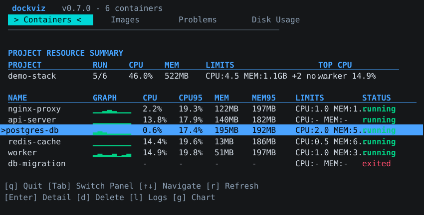
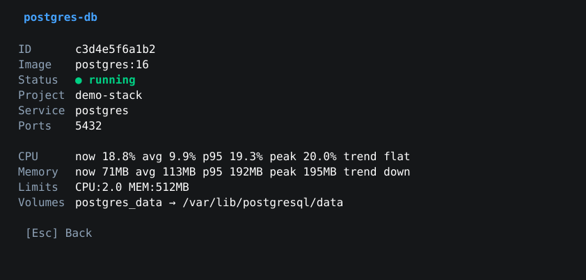
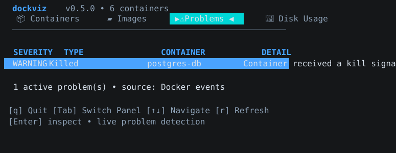
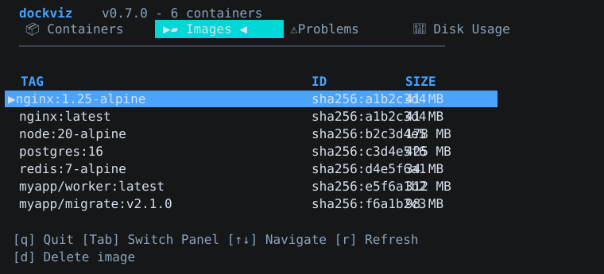
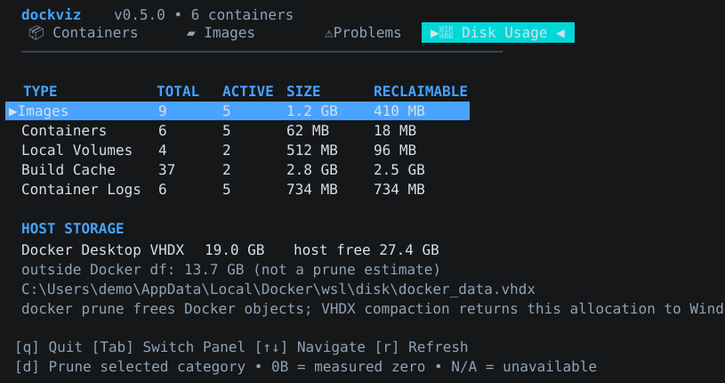
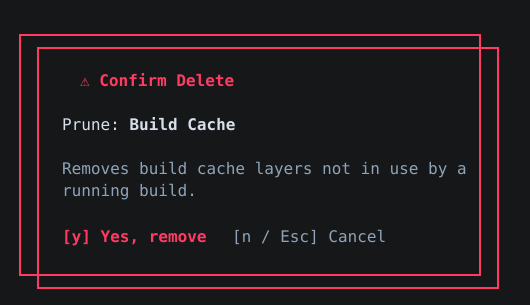
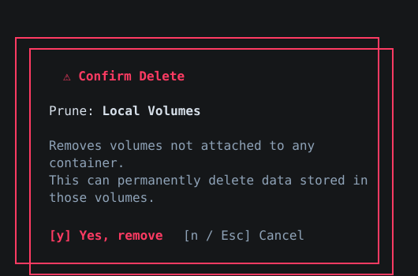

<div align="center">

# dockviz-cli

**A terminal dashboard for Docker problems and storage cleanup.**

[](https://go.dev/)
[](LICENSE)
[](https://github.com/0206pdh/dockviz-cli/releases/latest)
[](https://github.com/charmbracelet/bubbletea)

**[Korean documentation](README.ko.md)**

</div>

---

## What it is

`dockviz` is a live TUI for answering two operational questions:

1. Is a container currently showing a meaningful failure signal?
2. What is using Docker's disk space, and what can be reclaimed?

It connects directly to the Docker daemon through the official Go SDK. It does
not replace Docker Engine or try to be a general-purpose Docker command
wrapper.

## Why use it

The Docker CLI is excellent for individual commands. `dockviz` is useful when
you need a compact, continuously updating view of several resources at once:

- container CPU, memory, status, ports, logs, and recent history;
- resource summaries with current, p95, peak/trend detail, and CPU/MEM limits;
- actionable problems derived from Docker events;
- image, stopped-container, volume, build-cache, and container-log usage;
- confirmation-gated cleanup actions with the reported reclaimed space.

## Dashboard panels

The dashboard has four panels:

| Panel | Purpose |
|---|---|
| Containers | Live CPU/MEM, compose/project summary, p95 summaries, limits, detail, logs, and history chart |
| Images | Local image tags and safe tag/image removal |
| Problems | OOM/restart events, high CPU, memory pressure/growth, missing limits, and daemon disconnects |
| Disk Usage | Docker storage breakdown and category-level prune actions |

The former Networks, Events timeline, `exec`, container lifecycle controls, and
image pull-progress screens are intentionally outside the current product scope.

## Screenshots

| Containers | Container detail |
|---|---|
|  |  |

| Problems | Images |
|---|---|
|  |  |

| Disk Usage |
|---|
|  |

Disk cleanup actions are confirmation-gated. Build cache cleanup removes only
unused build-cache layers, while volume cleanup warns explicitly because unused
volumes can still contain important application data.

| Build Cache confirmation | Local Volumes confirmation |
|---|---|
|  |  |

## Installation

### PyPI

```bash
python -m pip install dockviz
```

Update an installed PyPI package with:

```bash
python -m pip install --upgrade dockviz
```

### Debian / Ubuntu APT repository

```bash
curl -fsSL https://0206pdh.github.io/dockviz-cli/apt/dockviz-archive-keyring.asc \
  | sudo gpg --dearmor -o /usr/share/keyrings/dockviz-archive-keyring.gpg
echo "deb [signed-by=/usr/share/keyrings/dockviz-archive-keyring.gpg] https://0206pdh.github.io/dockviz-cli/apt stable main" \
  | sudo tee /etc/apt/sources.list.d/dockviz.list > /dev/null
sudo apt update
sudo apt install dockviz
```

Update it with:

```bash
sudo apt update
sudo apt install --only-upgrade dockviz
```

### Linux / macOS release binary

```bash
curl -sL "https://github.com/0206pdh/dockviz-cli/releases/latest/download/dockviz-$(uname -s | tr '[:upper:]' '[:lower:]')-$(uname -m | sed 's/x86_64/amd64/;s/aarch64/arm64/')" \
  -o /usr/local/bin/dockviz
chmod +x /usr/local/bin/dockviz
```

Running the same command again updates the binary. There is currently no
`dockviz update` subcommand.

### Windows

Download `dockviz-windows-amd64.exe` or `dockviz-windows-arm64.exe` from the
[latest release](https://github.com/0206pdh/dockviz-cli/releases/latest).

### Build from source

```bash
git clone https://github.com/0206pdh/dockviz-cli.git
cd dockviz-cli
go build -o dockviz .
```

To update a source checkout:

```bash
git pull
go build -o dockviz .       # Linux/macOS
go build -o dockviz.exe .   # Windows
```

## Quick start

```bash
# Connect to the local Docker daemon
dockviz

# Run with simulated data; no Docker daemon is required
dockviz --demo

# Connect to a remote daemon
dockviz --host tcp://192.168.1.100:2375

# Or use DOCKER_HOST
DOCKER_HOST=tcp://192.168.1.100:2375 dockviz

# Print the build version
dockviz --version
```

The default path calls Docker `Ping()` before starting the TUI. `--demo` is
the only mode that avoids a live daemon.

## Quantitative scenario test

To verify the live daemon path with reproducible load, run the scenario
harness in [`scenarios/run-dockviz-performance.ps1`](scenarios/run-dockviz-performance.ps1).
It creates CPU, memory, log, restart-loop, and storage-pressure workloads, writes CSV/JSON
measurements, and removes only those test containers and the labelled test volume when it finishes. Keep
dockviz open in another terminal while the scenario runs to correlate the
numbers with the Containers, Problems, and Disk Usage panels.

For a larger disk-pressure test, use `-UseMaxSafeStorage`; it reserves 12 GiB
by default and uses the remaining workspace-drive capacity for the payload.

```powershell
powershell -ExecutionPolicy Bypass -File .\scenarios\run-dockviz-performance.ps1 `
  -RunLabel max-safe `
  -UseMaxSafeStorage `
  -StorageReserveGB 12 `
  -DurationSeconds 20 `
  -StorageReadyTimeoutSeconds 1800
```

For application-level Docker resource comparison, pass the same fixed
workload command with `-TargetImage` and `-TargetCommand` in both runs.
For focused CPU/MEM health detection, run
[`scenarios/run-dockviz-resource-health.ps1`](scenarios/run-dockviz-resource-health.ps1);
it creates CPU hog, memory pressure, memory growth, and no-limit containers
with compose-style labels so the Containers and Problems panels can be checked
directly.
The full Korean guide is in
[`docs/performance-scenarios.ko.md`](docs/performance-scenarios.ko.md).
An example daemon measurement is recorded in
[`docs/performance-results.ko.md`](docs/performance-results.ko.md).
The CPU/MEM health scenario smoke result is recorded in
[`docs/resource-health-smoke-results.ko.md`](docs/resource-health-smoke-results.ko.md).
An additional reclaim validation report, focused on unused tagged images,
dangling images, unused volumes, and Docker Desktop VHDX behavior, is recorded
in [`docs/reclaim-validation-report.ko.md`](docs/reclaim-validation-report.ko.md).
The CPU/MEM feature roadmap is documented in
[`docs/resource-management-roadmap.ko.md`](docs/resource-management-roadmap.ko.md).

## Problems panel

The Problems panel keeps the Docker event stream internally but hides normal
noise such as ordinary `create` and `start` events. It also evaluates recent
CPU/MEM history from the Containers panel and, once loaded, Disk Usage storage
offenders. Severity is used as an action priority:

- **OOM killed** — Docker reports that the container was killed by the OOM handler;
- **Abnormal exit** — a `die` event has a non-zero exit code;
- **Killed** — the container received a kill signal;
- **Restart loop** — at least three restart events occurred in ten minutes;
- **CPU saturated / High CPU / Elevated CPU** — recent CPU samples stayed high enough for critical, warning, or info classification;
- **Memory over limit / Memory pressure** — memory p95/current is over or near the configured memory limit;
- **Memory growth** — recent memory samples trend upward materially, critical if growth is close to the limit;
- **No resource limits** — a running container has neither CPU nor memory hard limits;
- **Idle memory** — a container holds significant memory while CPU stays idle;
- **Noisy neighbor** — one container dominates project CPU;
- **Storage offenders** — large logs, build cache, unused images, stopped-container layers, unattached volumes, or Docker Desktop host-storage gap;
- **Daemon disconnected** — the event stream was interrupted.

Current severity thresholds:

| Signal | Info | Warning | Critical |
|---|---:|---:|---:|
| CPU recent average | >=60% | >=80% | >=95% |
| Memory / limit | >=60% | >=80% | >=100% |
| Logs reclaimable | >=100 MB | >=500 MB | >=2 GB |
| Build cache reclaimable | >=500 MB | >=2 GB | - |
| Unused tagged/dangling images | >=100 MB | >=1 GB | - |
| Stopped container writable layers | >=500 MB | >=2 GB | - |
| Unattached volumes | >=100 MB | >=1 GB | - |
| Docker Desktop host-storage gap | >=1 GB | >=10 GB | - |

A later `start` or `unpause` event clears a crash/kill problem for that
container. The initial event query covers the previous hour, while problem
classification focuses on the recent ten-minute window.
Press `[Enter]` on a problem to inspect its detail, current resource context,
and a read-only recommendation.

## Disk Usage panel

The panel uses Docker's `system/df` API and adds storage signals that Docker's
own `docker system df` does not report.

| Category | Current action |
|---|---|
| Images | Removes dangling, untagged images |
| Containers | Removes stopped containers |
| Local Volumes | Removes unattached local volumes; review carefully because data can be deleted |
| Build Cache | Removes unused build-cache layers |
| Container Logs | Truncates active log files and removes rotated siblings |

On Windows Docker Desktop with the WSL2 backend, the panel also shows a
read-only Host Storage section for `docker_data.vhdx` when it can be measured
locally. This is intentionally separate from the prune table: Docker prune
removes daemon-level objects, but the VHDX file can remain expanded until Docker
Desktop/WSL compaction returns that allocation to Windows.

When available, dockviz also shows the part of the VHDX allocation that is
outside Docker's `system/df` accounting. That number is a diagnostic gap, not a
prune estimate.

Select a row and press `d` to open the confirmation dialog. The operation is
performed through Docker's API for the first four categories. Container log
cleanup is a local filesystem operation because Docker has no portable API for
the exact on-disk log-file size.

The panel refreshes automatically every 10 seconds while it is visible; press
`r` for an immediate refresh. `0B` means Docker measured zero reclaimable
bytes. `N/A` means the daemon returned a resource whose size or log path could
not be measured. Tagged images that are unused but outside the safe
dangling-image prune are shown as a separate note instead of being silently
counted as reclaimable.

Do not read a large Host Storage VHDX value as Docker reclaimable space. It is
the host-side virtual disk allocation, which may include free space inside the
Docker Desktop VM that Docker can reuse but Windows has not reclaimed yet.

### Container Logs limitations

Exact log size requires dockviz and the daemon to share a filesystem and for
the process to have access to the daemon's log directory. Native Linux and a
WSL distribution running `dockerd` directly can support this. Docker Desktop
and remote `DOCKER_HOST` setups may report the category as unavailable or zero
because the daemon's filesystem is inside another VM or host.

Do not treat an unavailable log measurement as proof that no logs exist.

## Keyboard shortcuts

| Key | Action |
|---|---|
| `q` / `Ctrl+C` | Quit |
| `Tab` | Switch between Containers, Images, Problems, and Disk Usage |
| `↑` / `k` | Move up |
| `↓` / `j` | Move down |
| `Enter` | Open container detail |
| `Esc` | Go back or close an overlay |
| `d` | Delete selected container/image, or prune the selected disk category |
| `l` | Open live logs for the selected container |
| `r` | Refresh data and reconnect the event stream if needed |
| `g` | Open the CPU/MEM history chart |

## Docker connection

The live client uses `DOCKER_HOST` and Docker's normal environment settings.
The `--host` flag overrides `DOCKER_HOST` when supplied.

The daemon must allow the current user to access its socket or endpoint. A
remote TCP endpoint should be protected with appropriate TLS/network controls;
an unauthenticated Docker TCP socket is equivalent to remote root access.

## Architecture

```text
main.go
  └─ cmd/root.go                 Cobra flags: --demo, --host, --version
      └─ internal/tui/start.go
          ├─ docker.NewClient()  live Docker SDK client
          ├─ docker.NewDemoClient()
          └─ Bubble Tea model
              ├─ Containers
              ├─ Images
              ├─ Problems
              └─ Disk Usage
```

The Docker SDK and demo implementation share the `DockerClient` interface, so
the TUI can be tested without a daemon.

The main implementation areas are:

- `internal/docker/client.go` — daemon connection and API version negotiation;
- `internal/docker/containers.go` — container listing and one-shot stats;
- `internal/docker/images.go` — local image listing/removal;
- `internal/docker/diskusage.go` — storage accounting and cleanup actions;
- `internal/docker/events.go` — lifecycle event stream;
- `internal/docker/logs.go` — live log stream and Docker multiplexing;
- `internal/tui/problems.go` — event-to-problem classification;
- `internal/tui/view.go` and `internal/tui/update.go` — TUI rendering and state transitions.

## Development

```bash
go test ./...
go vet ./...
go build ./...
```

The test suite covers the pure classification/formatting logic and demo client.
Real-daemon integration tests are still a separate validation layer because
Docker socket access, filesystem sharing, permissions, and available resources
depend on the environment.

## Release

Release automation lives in `.github/workflows/release.yml`. A release build
is created only when a version tag such as `v1.2.3` is pushed. Ordinary pushes
to `main` do not create releases or auto-bump patch tags. The build injects the
version with:

```bash
go build -ldflags="-X main.version=v1.2.3" -o dockviz .
```

Local builds without `-ldflags` report `dev` as their version.

## License

MIT © 2026 [0206pdh](https://github.com/0206pdh)
